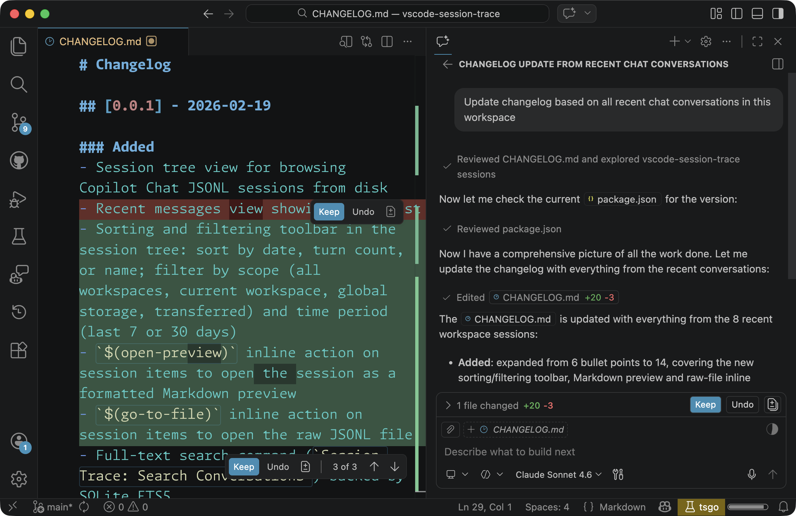

# Session Trace

[](https://github.com/digitarald/vscode-session-trace/actions/workflows/build.yml)

> **Your Copilot Chat history, made searchable and queryable.**

A VS Code extension that indexes your Copilot Chat session files (`.jsonl`) into a local SQLite database and exposes them through a tree view, a quick-pick search, and a language model tool for conversational queries.



## ✨ Try It Out

Ask questions about your own chat history right in Copilot Chat using `#searchChatSessions`:

| | Prompt |
|---|---|
| 📋 | *Generate a changelog based on all recent chat conversations in this workspace* |
| ⏰ | *At which times am I most productive, doing the most frequent code changes?* |
| 📂 | *How do I usually start my chat sessions that end up editing many files?* |
| 🐛 | *In my chat sessions, what caused most errors?* |
| 🔌 | *Search my chat history which MCPs I use most in the past 10 days* |
| 🤔 | *What are questions I didn't ask yet about my chat sessions, but SHOULD have asked?* |

## 🚀 Features

### 🌲 Session Tree View
Browse all Copilot Chat sessions stored on disk — workspace sessions, global (empty window) sessions, and transferred sessions. Expand each session to see individual turns with their prompts and responses.

The view toolbar provides:

- **Sort & Filter…** — one button opens a picker with three sections: *Sort* (date / turns / name), *Workspace* (All sessions · This workspace · All workspaces · Empty Window · Transferred), and *Time range* (all time · last 7d / 30d / 90d). The current selection in each section is marked with a checkmark. The active filter is shown in the view's subtitle.
- **Switch to Recent View** / **Switch to Sessions View** — toggle between the grouped sessions tree and a flat recent-messages view that streams in the latest turns with their full prompt and response content.

### 🔍 Search Conversations
Use the **Session Trace: Search Conversations** command (`Ctrl+Shift+P`) to fuzzy-search across all indexed prompts, responses, and session titles using full-text search backed by SQLite FTS5.

### 🤖 `#searchChatSessions` Language Model Tool
In Copilot Chat, reference `#searchChatSessions` to query your history with natural language, SQL, or full-text search:

```
What did I ask about React hooks last week? #searchChatSessions
```

The tool supports three query modes:

| Mode | Description |
|------|-------------|
| **`describe`** | Schema overview: row counts, annotation distribution, top tools, models, and date range |
| **`query`** | Full-text search via FTS5 with BM25 ranking (implicit AND, supports OR/NOT) |
| **`sql`** | Read-only SQL SELECT for aggregations, complex filters, and joins |

## 📖 Usage

1. Install the extension.
2. Open the **Session Trace** activity bar panel (speech-bubble icon).
3. Sessions are discovered and indexed automatically on activation.
4. Use the **Refresh** button to re-index after new sessions are created.
5. Click **Sort & Filter…** to narrow or reorder the session list, including filtering to the current workspace only.
6. Click the **Switch to Recent View** button to browse the latest conversation turns inline.
7. Click the **Search** icon or run `Session Trace: Search Conversations` to search.

## 🗄️ Data Storage

The extension discovers `.jsonl` session files from VS Code's user data directory (derived from `ExtensionContext.globalStorageUri`). It supports:

| Path | Description |
|------|-------------|
| `User/globalStorage/emptyWindowChatSessions/` | Global (empty window) sessions |
| `User/globalStorage/transferredChatSessions/` | Transferred sessions |
| `User/workspaceStorage/{hash}/chatSessions/` | Per-workspace sessions |

The SQLite index is stored in the extension's global storage directory and is rebuilt incrementally.

## 📋 Requirements

- VS Code `^1.99.0`
- GitHub Copilot Chat extension

## ⚙️ Extension Settings

This extension contributes no user-configurable settings.

